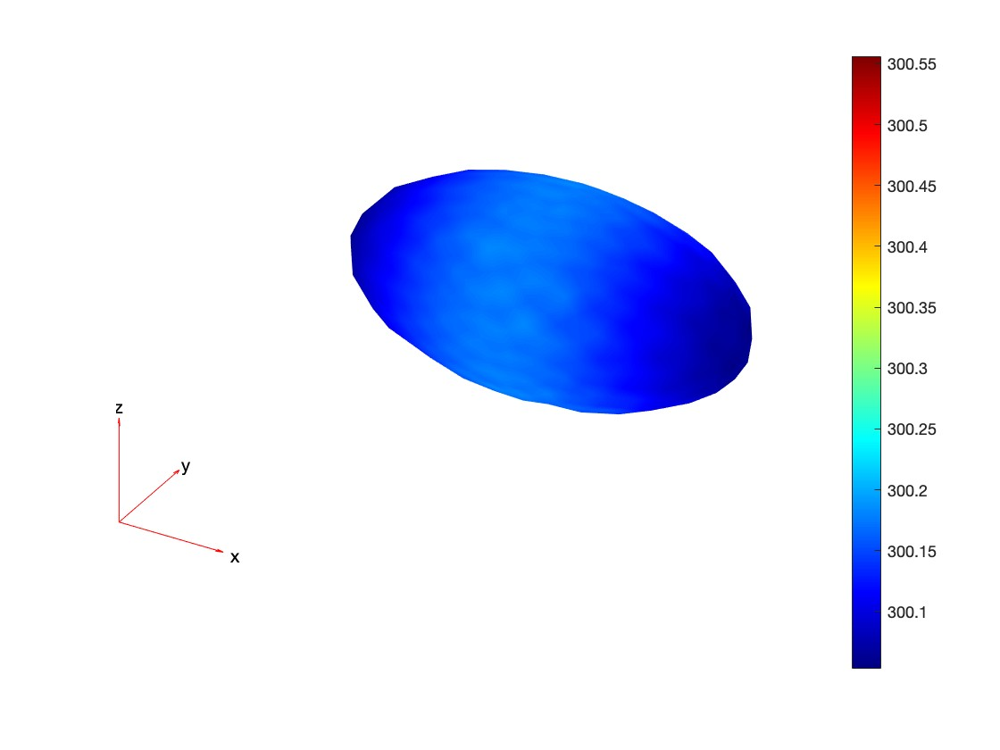
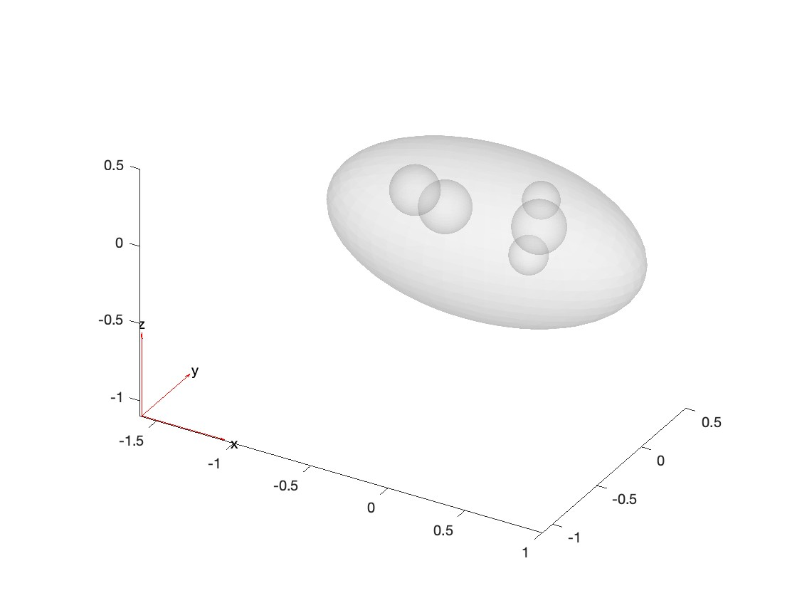
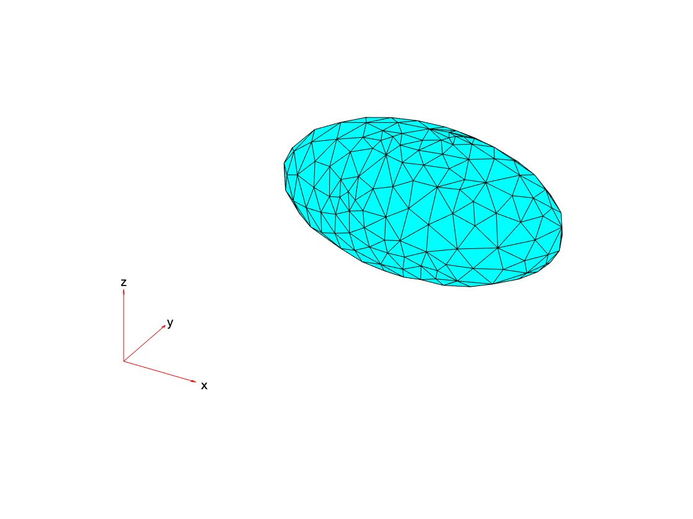
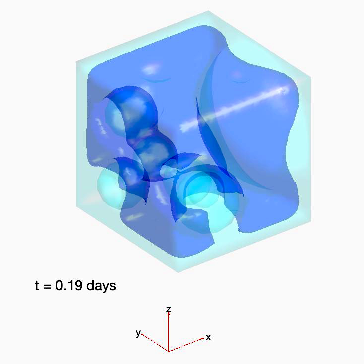
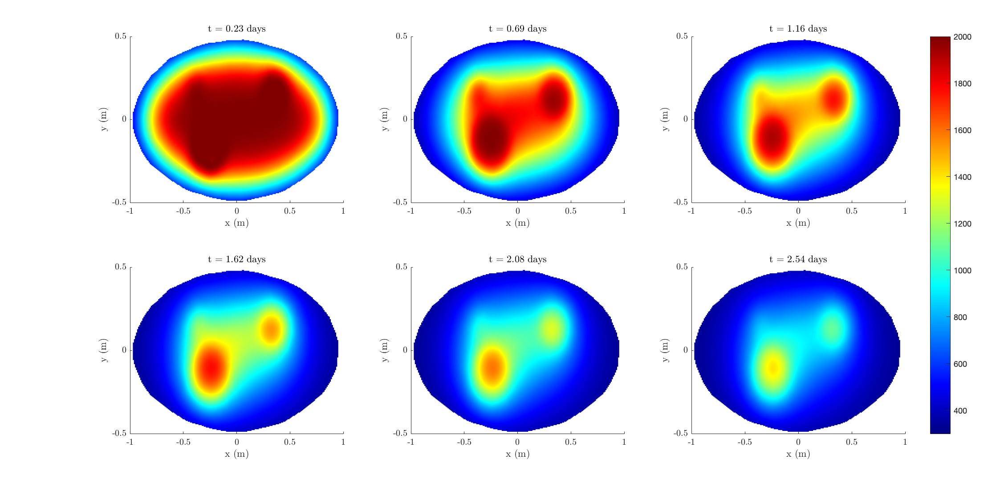

# Results Exploitation

## Get the temperature of a point at every $t$ (`tools.interpolateTemperature`)

The built-in function allows to interpolate temperature in thermal result at arbitrary spatial locations. 

(from [the MATLAB documentation](https://fr.mathworks.com/help/pde/ug/pde.steadystatethermalresults.interpolatetemperature.html))

| Fields      |        Type         | Description |
| ----------- |     ----------      | ----------- |
| thermalresults  |  TransientThermalResults  | results of the simulation returned by `Simulate`  |
| querypoints   | double |  query points, specified as a real matrix with either two rows for 2-D geometry, or three rows for 3-D geometry. interpolateTemperature evaluates temperatures at the coordinate points querypoints(:,i), so each column of querypoints contains exactly one 2-D or 3-D query point.
| iT | double | time indices, specified as a vector of positive integers. Each entry in iT specifies a time index.


## Built-in visualization tools

The `geometryView` function allows the user to save the following figures of the geometry in a pdf file.
One can call the function in a script using: 

```matlab
tools.geometryView('Geometry.pdf', simulation, geometry);
```
It saves in a file the three following figures:

### pdeplot3D

Plot solution or surface mesh for 3-D problem. 

```matlab
simulation=Simulate(geometry, options);
figure;
pdeplot3D(simulation.Mesh,ColorMapData=simulation.Temperature(:,end));
```




### pdegplot 

Plot PDE geometry. 

```matlab
figure;
pdegplot(geometry.structure, "FaceAlpha",0.2);
```




### pdemesh

Plot PDE mesh.

```matlab
simulation=Simulate(geometry, options);
figure;
pdemesh(simulation.Mesh);
```




### Isosurface 3D animation

One can create an animation of the thermal evolution at a given temperature. The `isosurface` function hence export the animation in a video file. Parameters are the video filename, the result structure of the simulation, and a temperature to render the isosurface. 

Example : Animation of a cube with voided cavities at Curie temperature

```matlab
tools.isosurface('Animation.avi', simulation, options.TCurie);
```



### Heat map slice view

One can represent the temperature distribution inside the geometry at different time steps, inside a chosen plane. To do so, the `heatMapSlice` and `heatMapSliceAnimation` functions located in the `tools` folder are implemented. The first one outputs a subplot of the heatmap at different times, whereas the second outputs an animation under a video file. They both take the following parameters 

| Fields         |        Type              | Description |
| -----------    |     ----------           | ----------- |
| filename       |        string            | filepath under which to save the animation  |
| thermalResults | TransientThermalResults  | result of the simulation returned by `Simulate`  |
| view_type      |        string            | Slice plane for representation; must be `'x'`, `'y'`, or `'z'` |
| value          |        double            | Value of the slice view plane |


Example : One can obtain the visualization in the `z=0` plane by calling the function

```matlab
tools.heatMapSlice('slice.pdf',simulation,'z',0);
tools.heatMapSliceAnimation('sliceAnimation.avi',simulation,'z',0);
```

