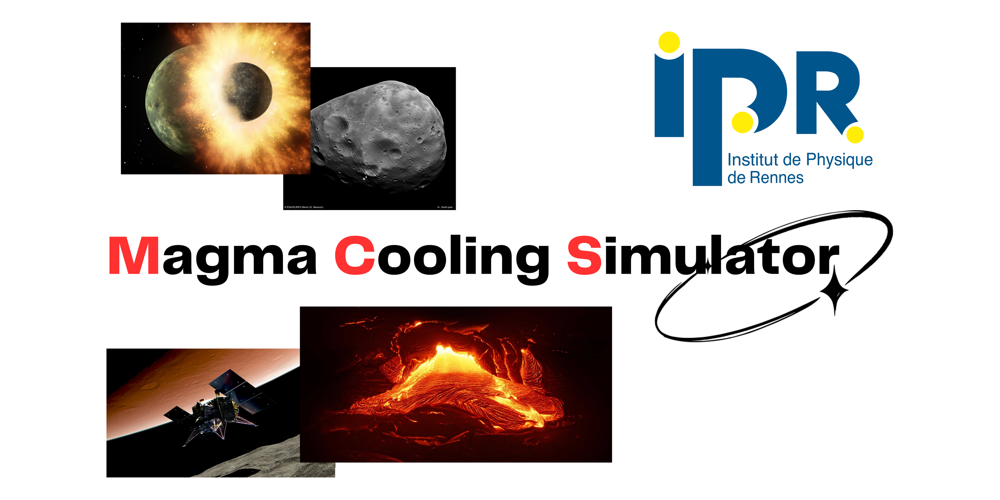
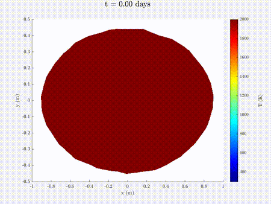

# MCS : Magma Cooling Simulator

By Tom Chauveau and Noé Busson, Interns at the Institute of Physics of Rennes,

Supervised by Mariko and Kevin Dunseath, Professors at the University of Rennes, researchers at the Institute of Physics of Rennes 2024
## Purpose

This model simulates the natural cooling of magma-composed particles of different geometries.

The original purpose for this code is to observe the cooling of the leftovers resulting from a potential collision between Mars and a protoplanet four billions years ago.

In this context, the particles simulated are part of the accretion disk which ended forming Phobos and Deimos *(P. Rosenblatt et al., Accretion of Phobos and Deimos in an extended debris disc stirred by transient moons. Nat. Geosci. 9, 581–583 (2016)*.

This model focuses on the resolution of the heat transfer equation and uses MATLAB (PDE Toolbox) as its main support.

A [Python bridge](doc/bridge.md) permitting to use the model without leaving Python is available. It relies on the [MATLAB engine API for Python](https://fr.mathworks.com/help/matlab/matlab_external/install-the-matlab-engine-for-python.html).

## Documentation

You can find the documentation of this project available in the the different pages of the documentation listed below or summarised in [the user guide](doc/UserGuide.pdf) (which adds images and concrete examples on how to properly use the model).

| Page            |   Description        |
| -----------     | -------------------- |
| [Structure](doc/structure.md)          | [Code Hierarchy](doc/structure.md#code-hierarchy) and [MATLAB Structures](doc/structure.md#matlab-structures)|
| [Geometries](doc/geometries.md)        | Fetching new geometries |
| [Exploitation](doc/exploitation.md)    | Result exploitation tools |
| [Bridge](doc/bridge.md)                | Python-MATLAB bridge |  

## Project

The MATLAB example script, [`scriptExample.m`](scriptExample.m) is a good way to introduce yourself to how the model works.
### Abstract
This model [takes a geometry](doc/geometries.md) (which can be imported, modfied, generated), associates it the physical properties defined by the user, simulate the temperature evolution in the object according to the given boundary conditions (solving the heat transfer equation) and returns a MATLAB `TransientThermalResults` object.

### `Simulate`
| Fields      |        Type          |     Description    |
| ----------- |     ----------       |     -----------    |
| geometry    | pde.DiscreteGeometry | [Simulated geometry](doc/geometries.md) |
| options     | structure with field | [Model options](doc/structure.md#options)      |

Returns `TransientThermalResults`

### Results Exploitation

Several tools are available to exploit the simulation results. You can find them listed in [the related part of the documentation](doc/exploitation.md).
